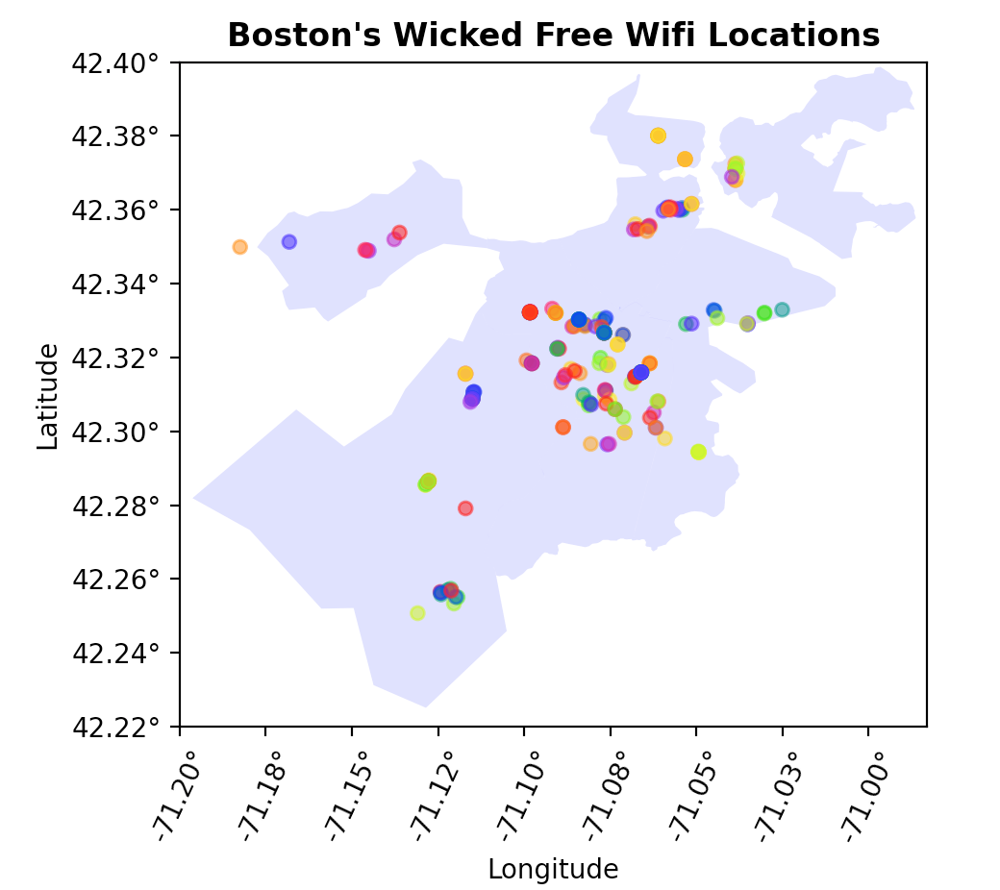
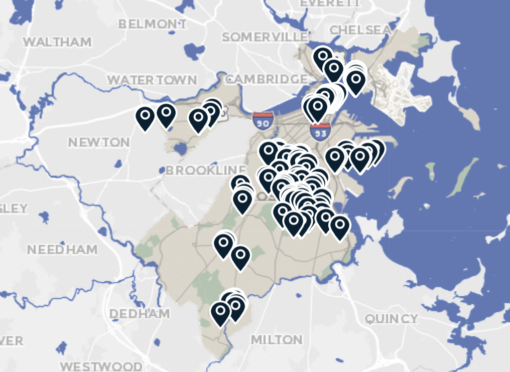

# Wicked Free Wifi

### data.boston.gov has some great free datasets available for public use.

This project uses two of them:

1. [Boston Transportation Districts](https://data.boston.gov/dataset/boston-transportation-department-btd-districts)

- This provides the shapefile used to display the map of Boston

2. ["Wicked Free Wifi" Locations](https://data.boston.gov/dataset/wicked-free-wifi-locations)

- This provides the CSV containing data about Boston's ["Wicked Free Wifi"](https://www.boston.gov/departments/innovation-and-technology/how-wicked-free-wi-fi-works) locations

# To Run:

`$ python3 ./map_it.py`

##### This generates a plot showing the locations of the "Wicked Free Wifi" locations across Boston:

##### Here's a WiFi map from [boston.gov](https://www.boston.gov/departments/innovation-and-technology/how-wicked-free-wi-fi-works#map--262256) to compare:

